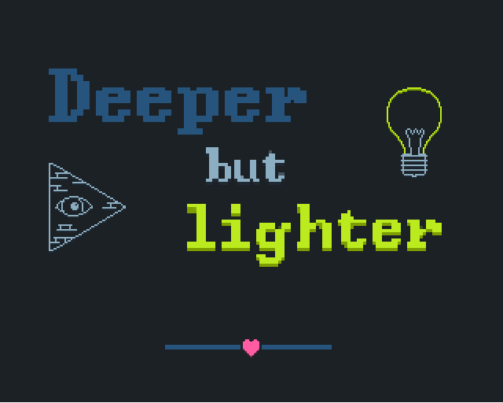

# Deeper but Lighter
A short 2D story game created during Ludum Dare 48. It contains some nice minigames and a well wirtten story.

Pizza connoisseur and Illuminati-knower Tom has a little kerfuffle with his local Illumination-Agency.
Follow Tom and assist him on his quest of saving what is most dearest to his heart.

# [Play it here](https://jonasbernard.itch.io/deeper-but-lighter)

## Team
As the Ludum Dare Game Jam allows team submissions, I worked in a team with [@Roman Gräf](https://github.com/romangraef), go check his him out as well!
